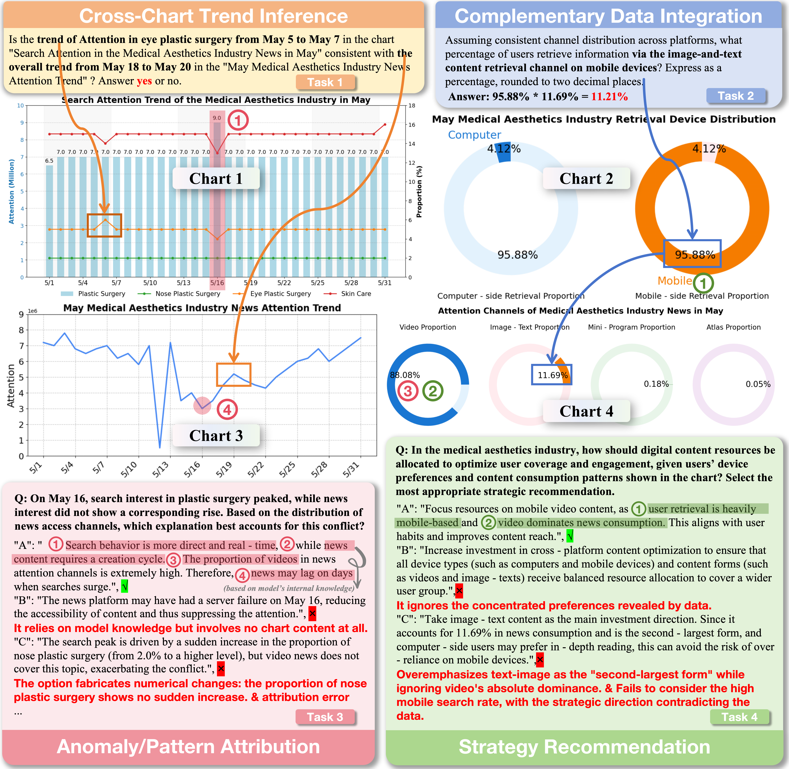
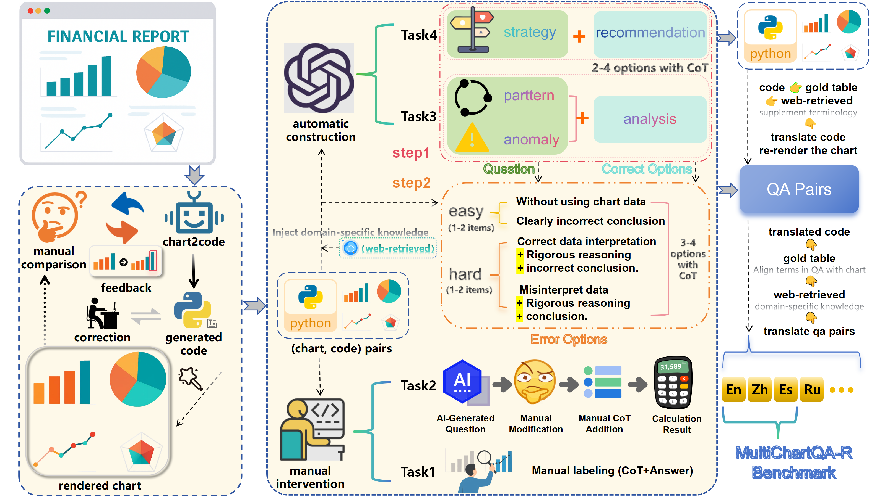

# MultiChartQA-R

**MultiChartQA-R: A Benchmark for Multi-Chart Question Answering in Real-World Reasoning Scenarios**

MultiChartQA-R is a benchmark for **multi-chart question answering**, designed to evaluate multimodal large language models (MLLMs) in realistic reasoning settings. It extends prior multi-chart resources with broader task coverage, multilingual data, a scalable data construction pipeline, and evaluation protocols for both **multi-select** and **generative** settings.

## Quick Links

[Appendix PDF](./appendix.pdf) | [Main Benchmark](./benchmark/) | [Extended Benchmark](./benchmark-extended/) | [Code Utilities](./code/)

> The appendix includes detailed benchmark statistics, metric definitions, prompt templates, multilingual breakdowns, extended benchmark details, and supplementary analyses.

## Overview

MultiChartQA-R studies reasoning over **multiple related charts**, rather than isolated single-chart understanding. The benchmark is designed to cover a progression of abilities from basic cross-chart perception to decision-oriented reasoning.

Each language version currently contains:

- **180** multi-chart sets
- **695** chart-code pairs
- **2,160** QA pairs
- **4** task types

The benchmark currently supports **English**, **Chinese**, and **Spanish**, and is designed to be extendable to additional languages.

In addition, we provide an **extended benchmark** for retrieval-oriented analysis, built from **101** multi-chart articles with **1,212** QA pairs, to study how model performance changes as the number of charts and the amount of relevant information increase.

## JSON Format Notes

The main benchmark JSON files are stored under `benchmark/json/{cn,en,es}`. Each file contains a multi-chart set and its `qa_pairs`.

- **Task 1 / Task 2** entries include direct answers and, for Task 2, explanatory calculations in the `explanation` field.
- **Task 3 / Task 4** entries include the released multi-select supervision fields:
  - `label`: correct option set
  - `easy_error`: distractors corresponding to clearly unsupported or obviously incorrect choices
  - `hard_error`: distractors corresponding to more plausible but ultimately incorrect choices
- **Task 3 / Task 4** entries additionally include a `cot` field, which stores option-level explanations for why each option is correct or incorrect.

This format supports answer evaluation, instruction construction, explanation analysis, and option-level supervision.

## Task Definition

MultiChartQA-R includes four progressively more complex task types:

1. **Cross-chart Trend Inference**  
   Determine whether trends or patterns across charts are aligned, divergent, or otherwise related.

2. **Complementary Data Integration**  
   Combine evidence from multiple charts to derive a missing value, comparison, or aggregated conclusion.

3. **Anomaly and Pattern Analysis**  
   Identify and explain non-trivial anomalies or patterns grounded in multi-chart evidence.

4. **Strategy Recommendation**  
   Produce decision-oriented recommendations supported by cross-chart analysis.

## Preview



## Data Construction Pipeline



MultiChartQA-R is built through a scalable pipeline that supports both realistic benchmark construction and multilingual extension:

- **Chart-code pair construction:** Reconstruct chart-rendering code from real-world multi-chart examples to preserve structured data.
- **Task-specific QA synthesis:** Build the four tasks with a mix of manual annotation and model-assisted generation plus human refinement.
- **Multilingual expansion:** Extend both chart content and QA pairs to multiple languages while maintaining semantic consistency.

## Repository Structure

```text
MultiChartQA-R/
├── benchmark/              # Main benchmark data
│   ├── images/
│   ├── images_info/
│   ├── code/
│   └── json/
├── benchmark-extended/     # Retrieval-oriented extended benchmark
├── code/                   # Public utilities: loaders, prompt templates, evaluators, inference template
├── readme.assets/          # README figures
└── appendix.pdf            # Appendix document
```

## Quick Start

### 1. Load the datasets

```bash
cd code
python load_benchmark.py
python load_exbenchmark.py
```

These scripts load the released benchmark files and print example samples from the main benchmark and the retrieval-oriented extended benchmark.

### 2. Run inference for Task 1-4

Use the released API templates with environment variables:

```bash
cd code
export OPENAI_BASE_URL=https://your-endpoint/v1
export OPENAI_API_KEY=your_api_key

python inference_multiselect_api_template.py --model your-model-name --task 1 --language en --sample-index 0
python inference_multiselect_api_template.py --model your-model-name --task 2 --language en --sample-index 0
python inference_multiselect_api_template.py --model your-model-name --task 3 --language en --sample-index 0
python inference_multiselect_api_template.py --model your-model-name --task 4 --language en --sample-index 0
```

For generative inference on Task 3 / Task 4:

```bash
cd code
export OPENAI_BASE_URL=https://your-endpoint/v1
export OPENAI_API_KEY=your_api_key

python inference_generative_api_template.py --model your-model-name --task 3 --language en --sample-index 0
python inference_generative_api_template.py --model your-model-name --task 4 --language en --sample-index 0
```

The released public scripts use environment variables instead of hardcoded credentials.

### 3. Evaluate predictions for all tasks

```bash
cd code
python eval_task1_accuracy.py --result-file path/to/task1_predictions.jsonl
python eval_task2_accuracy.py --result-file path/to/task2_predictions.jsonl
python eval_task34_strict_risk_aware.py --result-file path/to/task3_multiselect_predictions.jsonl
python eval_task34_strict_risk_aware.py --result-file path/to/task4_multiselect_predictions.jsonl
```

For primary generative evaluation of Task 3 / Task 4, we provide an answer-extraction-based judge template:

```bash
export OPENAI_BASE_URL=https://your-endpoint/v1
export OPENAI_API_KEY=your_api_key
python eval_task34_generative_answer_extraction.py --result-file path/to/task3_generative_predictions.jsonl --judge-model your-judge-model
python eval_task34_generative_answer_extraction.py --result-file path/to/task4_generative_predictions.jsonl --judge-model your-judge-model
```

### 4. File map for the public code release

- `data_utils.py`: load the main benchmark and the extended benchmark
- `prompts.py`: prompt templates for multi-select inference and Task 2 rationale-to-code conversion
- `parse_predictions.py`: parse JSON-style model outputs
- `inference_multiselect_api_template.py`: API inference template for Task 1-4 multi-select
- `inference_generative_api_template.py`: API inference template for Task 3 / Task 4 generative setting
- `eval_task1_accuracy.py`: Task 1 accuracy
- `eval_task2_accuracy.py`: Task 2 answer-level accuracy
- `eval_task34_strict_risk_aware.py`: Task 3 / Task 4 multi-select Strict Risk-Aware `MF_beta`
- `eval_task34_generative_answer_extraction.py`: Task 3 / Task 4 generative primary score via answer extraction + strict risk-aware scoring
- `evaluation.py`: minimal usage examples

## Evaluation Protocol

For the main benchmark:

- **Task 1-2** use accuracy-based evaluation.
- **Task 3-4 (multi-select)** use a **Strict Risk-Aware** \( MF_{\beta} \) metric.
- **Task 3-4 (generative)** use a free-form generation protocol aligned with the benchmark’s option-level evaluation principle.

## Notes

- The benchmark is intended for research on realistic multi-chart reasoning, including multilingual analysis, retrieval scalability, and decision-oriented evaluation.

## Citation

If you find MultiChartQA-R useful, please cite the project/paper once the final bibliographic information is available.
